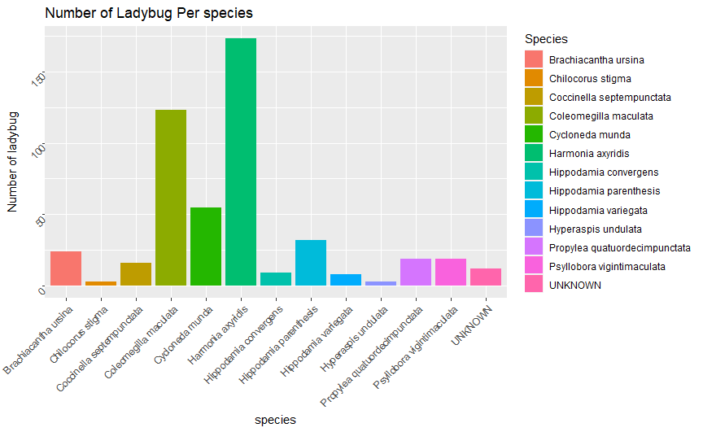
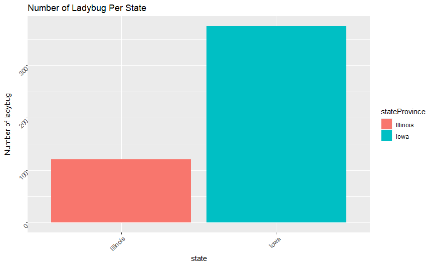
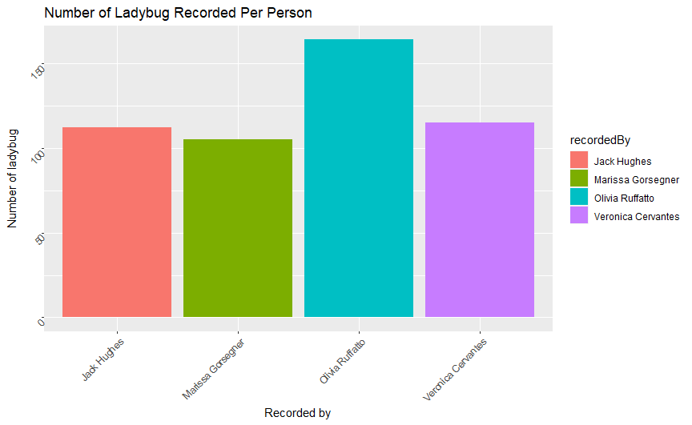

# Insect Carnivore Data
# Lady Bug per Species

* The species that was documented the most is the harmonia axyridis
* The second most documented species is the coleomegilla maculata

# Lady Bug per State

* The amount of lady bugs found in Iowa was significantly double the amount of lady bugs found in Illinois

# Record per Person

* Olivia Ruffatto recorded the most ladybugs 
* The other three students recorded roughly the same amount of ladybugs
