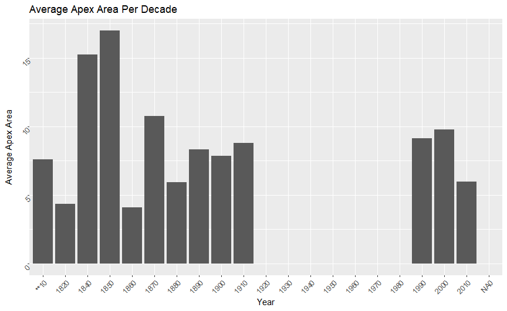

# Average Apex Area per Decade

* The average apex reached its peak in 1850
* Following its peak, the average apex saw its lowest average
* While reading the results based on the graph we found an error in our chart

# UPDATED Average Apex Area per Decade

* The average apex reached its peak in 2000
* The average apex was at its lowest in 1880
* There never seems to be a steady average between the decades

# Number of Butterfly per Country

* There are more than double Cabbage Butterflies documented in the United States compared to other countries
* Canada, Republic of Ireland, and United Kingdom all average roughly the same amount of documented butterflies

# Average Apex Area per Sex

* On average, the male butterfly has a larger apex area than the females

# Minimum Wing Length per Sex

* The male butterfly has a longer wing than the female butterfly at minimum.
